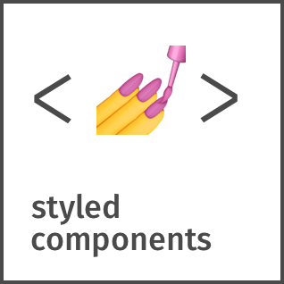

<!-- <h1>Hi Hi 👋, I am Vadim Trubay! </h1> -->

### Hi 👋, I am Vadim Trubay!

[Visit My Site](https://VadimTrubay.github.io/)

- 🎯 Portfolio website: [Portfolio](https://VadimTrubay.github.io/)
- 💬 Ask me about anything, I am happy to help :smile:
- 📬 How to reach me: [Let's get in touch! - linkedin](https://linkedin.com/in/vadim-trubay-146607257)

### Languages and Tools:

&nbsp;
&nbsp;
&nbsp;
&nbsp;
&nbsp;
&nbsp;
&nbsp;
&nbsp;
&nbsp;
&nbsp;
&nbsp;
&nbsp;
&nbsp;
&nbsp;
&nbsp;
&nbsp;
&nbsp;
&nbsp;
&nbsp;
&nbsp;
&nbsp;
&nbsp;
&nbsp;
&nbsp;
&nbsp;
&nbsp;
&nbsp;
&nbsp;
&nbsp;
&nbsp;
&nbsp;
&nbsp;

&nbsp;
&nbsp;
&nbsp;
<!--[website]: -->
